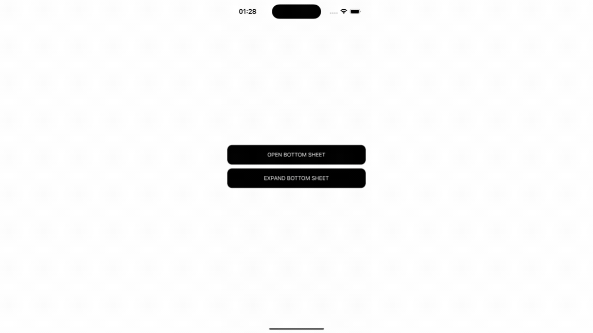

## @ahmetaltai/react-native-bottom-sheet

A highly efficient, stable, and customizable Bottom Sheet component for React Native. Designed to provide smooth performance with minimal configuration, this component is easy to integrate while offering extensive customization options for more complex use cases.

[](https://badge.fury.io/js/@ahmetaltai%2Freact-native-bottom-sheet)



    
## Features

- ⚡ **Fast and Stable:** Optimized for performance with minimal configuration.
- 🛠 **Simple Setup:** Requires only a few basic props to get started.
- 🎨 **Customizable:** Easily apply styles without needing complex configurations.
- ✋ **Gesture Support:** Offers native-like drag-and-drop gesture support with smooth animations.

## Installation

To install the package, use npm or yarn:

```bash
npm install @ahmetaltai/react-native-bottom-sheet
```

or

```bash
yarn add @ahmetaltai/react-native-bottom-sheet
```

## Usage Example

Here's a basic example of how to use the `BottomSheet` component:

```tsx
import React, { useRef } from 'react';
import { View, Button, Text } from 'react-native';
import BottomSheet from '@ahmetaltai/react-native-bottom-sheet';

const App = () => {
  const bottomSheetRef = useRef(null);

  const openBottomSheet = () => {
    bottomSheetRef.current?.open();
  };

  const closeBottomSheet = () => {
    bottomSheetRef.current?.close();
  };

  return (
    <View style={{ flex: 1 }}>
      <Button title="Open Bottom Sheet" onPress={openBottomSheet} />

      <BottomSheet
        ref={bottomSheetRef}
        points={['25%', '50%', '90%']}
        index={1}
        visible="90%" // The sheet remains open when `visible` is set
      >
        <View>
          <Text>This is the content inside the Bottom Sheet.</Text>
        </View>
      </BottomSheet>
    </View>
  );
};

export default App;
```

## Props

| Prop      | Type       | Default | Description                                                                           |
| --------- | ---------- | ------- | ------------------------------------------------------------------------------------- |
| `points`  | `string[]` | `[]`    | Defines the draggable positions for the sheet in percentages                          |
| `index`   | `number`   | `0`     | The initial index for the Bottom Sheet. Refers to the position in the `points` array. |
| `visible` | `string`   | `100%`  | Defines the position to display the sheet when initially visible.                     |
| `style`   | `object`   | `{}`    | Customize the appearance of the sheet and the backdrop.                               |

## Methods

The `BottomSheet` component exposes the following methods via `ref`. These methods allow you to control the behavior of the Bottom Sheet programmatically:

### `open()`

The `open()` method opens the Bottom Sheet to the position defined by the `index` prop. The `index` corresponds to one of the values in the `points` prop, determining where the Bottom Sheet will open.

- **`index`**: This is the initial position of the Bottom Sheet, defined by the `index` prop, which points to one of the values in the `points` array. For example, if `index={1}`, the Bottom Sheet will open at the second position in the `points` array.

### `close()`

Closes the Bottom Sheet.

### `expand()`

Expands the Bottom Sheet to the maximum point defined in the `points` prop.

## Explanation

- **`points`**: The `points` prop defines the draggable positions for the Bottom Sheet as percentages. For example, `['25%', '50%', '90%']` means the Bottom Sheet can be dragged between 25%, 50%, and 90% of the screen height.
- **`visible`**: When `visible` is set, the Bottom Sheet stays open, and it does not close upon background taps. This is useful for cases where you want the sheet to remain open, allowing background touches.

